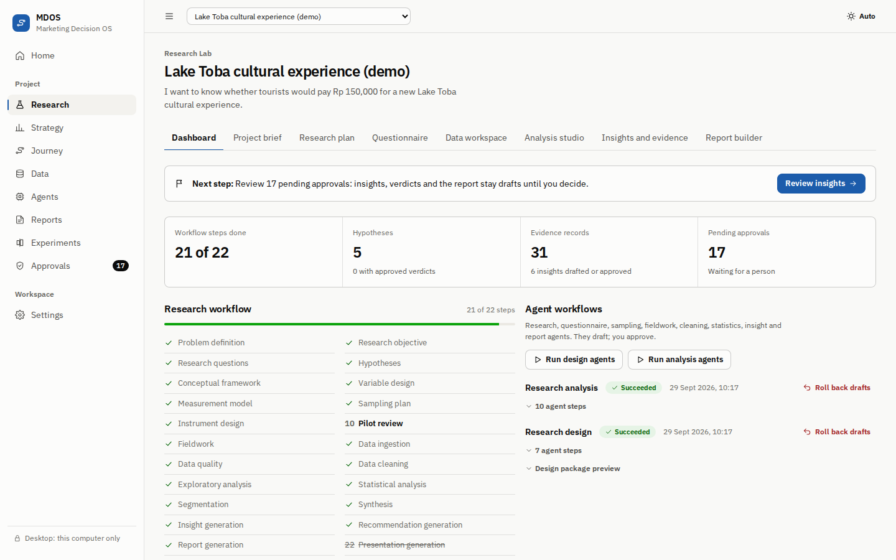
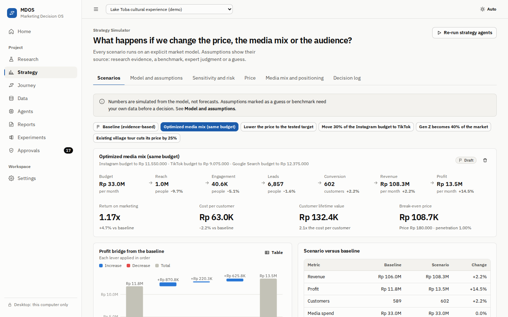
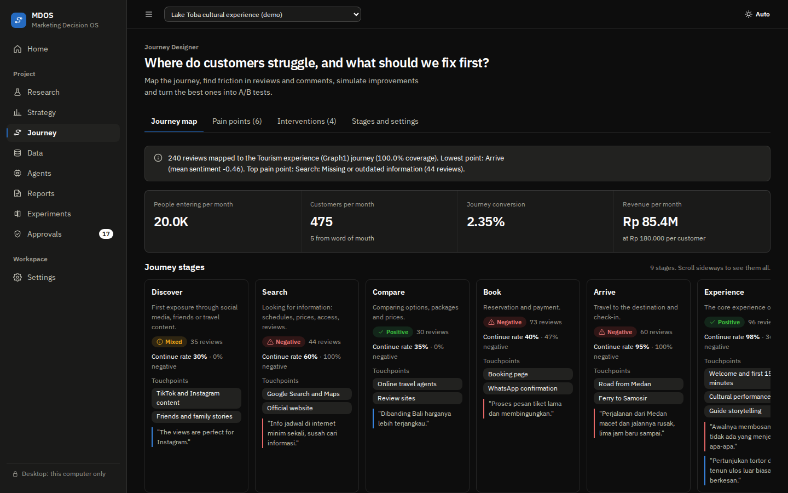

<!-- markdownlint-disable first-line-h1 -->
<!-- markdownlint-disable html -->
<!-- markdownlint-disable no-duplicate-header -->

<div align="center">
  <picture>
    <source media="(prefers-color-scheme: dark)" srcset="docs/assets/mdos-logo-dark.svg">
    
  </picture>
</div>
<hr>
<div align="center" style="line-height: 1;">
  <a href="https://github.com/samuelhtampubolon/MDOS/actions/workflows/ci.yml"></a>
  <a href="#4-quick-start"></a>
  <a href="#4-quick-start"></a>
  <br>
  <a href="backend/pyproject.toml"></a>
  <a href="frontend/package.json"></a>
  <a href="#5-claude-drafting-optional"></a>
  <a href="SECURITY.md"></a>
  <a href="LICENSE"></a>
</div>

<p align="center">
  <b>From a business question to defensible marketing evidence, strategy scenarios and a customer journey you can test.</b>
</p>

## Table of Contents

1. [Introduction](#1-introduction)
2. [What is inside](#2-what-is-inside)
3. [Screenshots](#3-screenshots)
4. [Quick start](#4-quick-start)
5. [Claude drafting (optional)](#5-claude-drafting-optional)
6. [How research stays defensible](#6-how-research-stays-defensible)
7. [Security and privacy](#7-security-and-privacy)
8. [Repository layout](#8-repository-layout)
9. [Development](#9-development)
10. [Documentation](#10-documentation)
11. [License](#11-license)
12. [Contact](#12-contact)

## 1. Introduction

Marketing Decision OS (MDOS) is one application for marketers and researchers, built first for emerging markets
such as Indonesia. Agents do the legwork and draft the wording; **numbers always come from code**, every statistic
shows its assumption checks, and **people approve** every insight, verdict, decision, cleaning step and experiment.

It runs two ways: as a **desktop app** that keeps everything on your computer, or as a **cloud app** for teams.

> **Status:** MVP, version 0.1.0. The Lake Toba demo uses synthetic data. Replace the labeled placeholder
> assumptions before making real decisions.

## 2. What is inside

| Module | What it does |
|---|---|
| **Research Lab** | Turns a business question into a research design, a bilingual (English and Indonesian) questionnaire and a sampling and fieldwork plan, then cleans the data, runs the statistics and drafts insights and a report. |
| **Strategy Simulator** | Builds a market model from the research evidence and simulates changes to price, media mix or audience, with sensitivity analysis, Monte Carlo risk and a decision log. |
| **Journey Designer** | Maps the customer journey, finds friction in reviews and comments, simulates fixes and turns the best ones into A/B tests whose results return to research as evidence. |

## 3. Screenshots

<div align="center">
  
  <br><br>
  
  <br><br>
  
</div>

The interface follows the Quiet Ledger design system: IBM Plex type, borders instead of shadows, one accent color
and color-blind-safe charts, each with a table view ([docs/18-interface-brief.md](docs/18-interface-brief.md)).

## 4. Quick start

### 4.1 Desktop app (one person, runs only on your computer)

1. Download the zip for your system from **Actions**, workflow "Desktop build" (or from a release), and unzip it.
2. Run `MDOS` (`MDOS.exe` on Windows). Your browser opens MDOS through a private link that changes every time the
   app starts; the link is also shown in the MDOS window.
3. Click **Load the Lake Toba demo** to see the whole loop on synthetic data.

Data stays in your user data folder, which only your account can open: `%LOCALAPPDATA%\MDOS`,
`~/Library/Application Support/MDOS` or `~/.local/share/mdos`. The app only accepts connections from your own
computer. To remove MDOS completely, close it, delete the unzipped app folder and delete that data folder.

### 4.2 From source

Requirements: Python 3.11 or newer and Node.js 22 or newer (CI uses Node.js 24).

```bash
# backend: exact, hash-checked dependencies, then the app in editable mode
cd backend
python -m venv .venv && source .venv/bin/activate   # Windows: .venv\Scripts\activate
pip install --require-hashes -r requirements.txt
pip install -e ".[dev]"

# frontend (built into backend/mdos/static; package scripts are not run)
cd ../frontend
npm ci --ignore-scripts && npm run build

# run the desktop mode
cd ../backend && mdos            # or: python -m mdos.desktop
```

For hot reload, run `uvicorn mdos.main:create_app --factory --reload` in `backend/` and `npm run dev` in
`frontend/`, then open `http://localhost:5173`.

### 4.3 Cloud (teams, accounts, PostgreSQL)

```bash
cp .env.example .env      # set SECRET_KEY and POSTGRES_PASSWORD
docker compose up --build
```

Open `http://localhost:8000` and create the first account; sign-up then closes unless you open it. The port is
published on your own computer only. For a team, put a TLS reverse proxy in front and follow
[docs/13-deployment.md](docs/13-deployment.md).

## 5. Claude drafting (optional)

Without an API key everything works offline with deterministic drafting. To let Claude draft wording (numbers never
depend on it), set on the server:

```bash
ANTHROPIC_API_KEY=...          # turns Claude on
MDOS_LLM_MODEL=claude-opus-5-5 # default
MDOS_LLM_EFFORT=medium         # low, medium or high
MDOS_LLM_FALLBACKS=true        # server-side fallback when the default model is unavailable
```

Before anything is sent, emails, phone numbers and ID numbers are masked. Drafted text is checked before use:
untrusted content is fenced off in the prompt, numbers must match the computed results, and causal wording is
blocked unless the evidence comes from an experiment.

## 6. How research stays defensible

* Every analysis reports its sample size, assumption checks (with robust alternatives when violated) and limitations.
* Insights and recommendations must cite evidence records; the evidence graph traces any item back to its data.
* Causal words such as "causes", "drives" or "increases" are rejected unless the cited evidence is experimental.
* Segmentation needs a stated objective and a variable rationale.
* Agents propose hypothesis verdicts and decisions; only a person can approve them.
* Cleaning creates a new dataset version with a checksum and an operations log; earlier versions stay restorable.

## 7. Security and privacy

| Area | Protection |
|---|---|
| Sessions | HttpOnly, SameSite=Strict cookie (`__Host-` over HTTPS); a CSRF header on every change; sign out on all devices |
| Desktop | Loopback only, host check, a random key per launch, sessions end when MDOS closes |
| Browser | Strict Content Security Policy, sandboxed report exports, no third-party requests |
| Data | Tenant isolation, upload limits and zip-bomb checks, formula-safe exports, confirmed project deletion |
| Claude | Optional; personal identifiers masked; the model has no tools and cannot act |
| Supply chain | Hash-pinned Python dependencies, npm without install scripts, actions pinned to commits, audits and a secret scan in CI |

Report a vulnerability privately as described in [SECURITY.md](SECURITY.md). The full review is in
[docs/19-security-hardening-review.md](docs/19-security-hardening-review.md).

## 8. Repository layout

```
backend/            FastAPI app, analytics engines, agents and tests (Python)
  mdos/analytics/   statistics: descriptives, cross-tabs, correlation, regression, reliability, mediation and
                    moderation, pricing (Van Westendorp, Gabor-Granger, WTP), segmentation, text themes, sentiment
  mdos/strategy/    market model, simulation engine, sensitivity, Monte Carlo, media optimizer
  mdos/journey/     journey templates, voice-of-customer mapping, intervention simulation
  mdos/agents/      agent contract, tool allowlists, Claude provider, supervisor workflows
  mdos/migrations/  database migrations (applied automatically at start-up)
frontend/           React and TypeScript web app (built into backend/mdos/static)
  e2e/              Playwright end-to-end tests against the real server
packaging/          desktop executable build (PyInstaller)
scripts/            desktop build, sample data generator, secret scan
docs/               synthesis, architecture, backlog, design system, security, deployment and methods
samples/            synthetic Lake Toba data for trying the app
```

## 9. Development

```bash
make test        # backend tests and frontend unit tests
make lint        # ruff and the TypeScript typecheck
make e2e         # end-to-end tests in a real browser
make desktop     # build the desktop executable for this system
python scripts/check_secrets.py   # the same secret scan CI runs
```

The backend suite also runs on PostgreSQL when `TEST_DATABASE_URL` is set (CI does both).

## 10. Documentation

**User manual:** [docs/MDOS-User-and-Operations-Manual.docx](docs/MDOS-User-and-Operations-Manual.docx), a Word
guide of about 26 pages with screenshots: installing the desktop app and the cloud version, every module, security,
administration, troubleshooting and the owner's checklist.

For the design, start with [docs/00-synthesis.md](docs/00-synthesis.md). Architecture: [docs/04-architecture.md](docs/04-architecture.md)
and [docs/05-agent-architecture.md](docs/05-agent-architecture.md). Design system:
[docs/09-design-system.md](docs/09-design-system.md). Rules for contributors and coding agents:
[AGENTS.md](AGENTS.md).

## 11. License

MDOS is released under the [MIT License](LICENSE). The open-source components it ships, and their licenses, are
listed in [THIRD_PARTY_NOTICES.md](THIRD_PARTY_NOTICES.md).

## 12. Contact

Questions and ideas: open an [issue](https://github.com/samuelhtampubolon/MDOS/issues/new/choose). Security reports:
follow [SECURITY.md](SECURITY.md), never a public issue.
