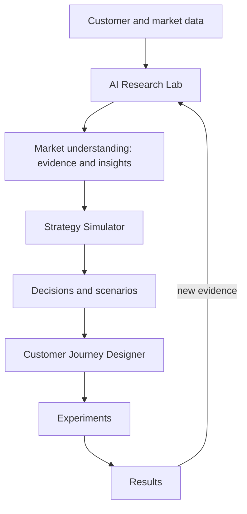

# 00 · Analysis and Synthesis of the Source Inputs

This document records how the three source inputs were analyzed, what is signal and what is noise,
where they conflict, and how each conflict was resolved. Everything else in `docs/` builds on it.

## 1. The inputs

| Input | File in repo | What it is | Size |
|---|---|---|---|
| Founder vision notes ("Graph1") | [`docs/source/graph1-founder-vision.txt`](source/graph1-founder-vision.txt) | Narrative product vision: three products, positioning against competitors, concrete scenarios, agent roster, phasing, closed-loop diagram | 193 lines |
| Build specification (JSON) | [`docs/source/marketing_decision_os_spec.json`](source/marketing_decision_os_spec.json) | Structured "operating contract" for an agentic build: modules, agents, features, UX, data, security, orchestration, roadmap, metrics, deliverables | 3,597 lines |
| Build specification (Markdown) | not duplicated | Byte-for-byte the same JSON wrapped in a Markdown code fence (verified programmatically: parsed JSON objects are equal, nothing outside the fence) | 3,606 lines |

## 2. Signal versus padding in the specification

The JSON has 23 top-level sections. The first 22 sections (about 660 lines) carry the real requirements.
The last section, `detailed_section_catalog`, is 420 entries (about 2,940 lines) that exist mainly to satisfy the
"at least 999 lines" requirement stated in `meta.line_requirement`:

* 420 entries are **54 unique topics repeated about 8 times** (S001 to S420).
* Every entry uses **the same sentence template**: "Define explicit acceptance criteria, failure modes, data inputs,
  outputs, human approval requirements, tests, and documentation for `<topic>`".
* Priority is assigned **by position, not by meaning**: entries 1 to 180 are P0, 181 to 320 are P1, 321 to 420 are P2.
  As a result every topic is simultaneously P0, P1 and P2, so the priority field carries no information.
* Every entry carries the same guardrail: "Do not let this section reduce the research-lab core below 40% of total product scope."

**Synthesis:** the catalog's actual content is one instruction applied to 54 topics. It is collapsed into a single
54-row table with real acceptance criteria, failure modes, inputs, outputs, approval gates, tests and phase:
[`16-section-catalog.md`](16-section-catalog.md). The 40% guardrail is enforced by measurement (see
[`10-mvp-backlog.md`](10-mvp-backlog.md), which reports the actual share of implementation per module).

## 3. What each input contributes

### The specification contributes the *contract*
* Three modules with target weights: Research Lab 42%, Strategy Simulator 31%, Journey Designer 27%.
* Principles: evidence versus assumption, interpretable analytics, human approval gates, MVP first.
* 50 named agents, about 70 named features, 20 core data entities, a lineage chain, 15 security requirements,
  a 10-field agent output contract, quality gates for statistics, a three-phase roadmap, product and quality metrics,
  and 15 required design artifacts.
* A process rule: ask 12 pre-build questions and do not code before writing the assumptions register, MVP scope,
  deferred scope, architecture, agent matrix and test strategy.

### The founder vision (Graph1) contributes the *why, who and where*
* **Positioning:** "Qualtrics + SPSS/SmartPLS + research consultant + AI agents", designed around a marketer's real workflow.
* **Differentiation:** not another AI survey generator and not "AI writes 50 Facebook posts".
  The promise is **"From business question to defensible marketing evidence"** and
  **"AI lets a marketer experiment with an entire marketing system."**
* **Market:** emerging-market businesses, SMEs, tourism, universities, and Indonesian researchers. Prices in rupiah (Rp).
* **Canonical scenarios** that became the acceptance tests of this build:
  1. "Would tourists pay Rp 150,000 for a new Lake Toba cultural experience?" (research).
  2. Price Rp 180,000 to Rp 150,000; move 30% of the ad budget from Instagram to TikTok; Gen Z becomes 40% of the
     market; a competitor launches a cheaper product (strategy).
  3. Reduce booking friction from five steps to two; redesign the first 15 minutes of the Lake Toba experience
     around local storytelling (journey).
* **Deployment:** "the web-based and the local exe", which is a hybrid deployment.
* **Phasing:** Phase 1 Research Lab (business question to research design to questionnaire to data upload to analysis
  to insight report), Phase 2 Strategy Simulator, Phase 3 Journey Designer.
* **Closed loop:** market data to research to understanding to strategy to decisions to journey to experimentation to
  results, and back to research.

## 4. Conflicts and how they were resolved

| # | Conflict | Resolution | Reversible? |
|---|---|---|---|
| C1 | The spec says "ask 12 questions and wait". The user said "do it". | Graph1 answers 8 of the 12 questions directly. The remaining 4 are answered with explicit, low-regret defaults recorded in the assumptions register and flagged for confirmation ([`01-pre-build-interview.md`](01-pre-build-interview.md)). No irreversible decision was taken. | Yes |
| C2 | The spec's MVP includes all three modules (42/31/27). Graph1 phases them 1, then 2, then 3. | Research Lab is built deep (the complete Phase 1 flow). Strategy and Journey are built as thin but working slices that consume research evidence, which is exactly what the spec's own MVP roadmap lists ("basic strategy scenario builder", "basic journey canvas"). This makes the closed loop demonstrable from day one without an oversized platform. | Yes |
| C3 | Spec journey stages are generic (Awareness to Retention, 10 stages). Graph1 stages are tourism-specific (Discover to Recommend, 9 stages). | Journey stage **templates**. "Tourism (Graph1)" is the default for the showcase, "Generic (spec)" is available, and every journey is editable. | Yes |
| C4 | The spec names 50 agents. Graph1 names about 15 and an 8-step research pipeline. | A registry lists all 50 spec agents. Each maps to one of 26 executable MVP agents or to a later phase ([`05-agent-architecture.md`](05-agent-architecture.md)). Graph1's pipeline is the default research workflow. | Yes |
| C5 | Spec puts mediation and moderation in Phase 2. Graph1 lists PROCESS analysis, MaxDiff, personas and positioning maps as outputs. | PROCESS Model 4 (mediation) and Model 1 (moderation), personas and a positioning map are in the MVP because they are cheap, standard in the target users' work and verifiable. PLS-SEM, conjoint and MaxDiff stay in Phase 2, and the construct and indicator data model is already in place for them. | Yes |
| C6 | Spec language is English. Graph1 targets Indonesian researchers and rupiah. | English UI; rupiah as the default currency; bilingual (English and Bahasa Indonesia) questionnaire items; bilingual stopwords and sentiment lexicon. A full Bahasa Indonesia UI is deferred and listed as a question. | Yes |
| C7 | Spec `coding_agent_instructions` lists Codex, Claude Code, Antigravity, Grok Build, OpenCode and OpenClaw. | These are build-time tools, not runtime features. Their roles are captured in [`AGENTS.md`](../AGENTS.md) so any of them can continue the build with the same conventions. | Yes |
| C8 | "Cloud SaaS, local application, or hybrid?" (spec Q10). Graph1: web plus local exe. | One codebase, two targets: cloud (Docker with PostgreSQL) and a desktop executable (PyInstaller, SQLite, runs offline on `127.0.0.1`). | Yes |

## 5. Expert observations that shaped the build

These points are not stated in either input but follow from marketing-science practice. They are encoded into the
software as checks, warnings or defaults.

1. **Stated willingness to pay is biased upward (hypothetical bias).** The canonical question ("would tourists pay
   Rp 150,000?") is a stated-preference question. The Research QA agent flags this automatically, the report states it
   as a limitation, and the closed loop recommends validating the price with a real-behavior experiment (for example a
   pre-sale page at two price points) in the Experiments module.
2. **Price questions need more than one method.** The questionnaire agent pairs Van Westendorp (acceptable price range)
   with Gabor-Granger (demand at specific prices) and a direct question at the target price, so the strategy simulator
   can build a price-response curve from research evidence instead of from a guessed elasticity.
3. **Cross-sectional surveys do not establish causality.** Regression and PROCESS outputs use associational language,
   and a lint check rejects causal wording ("causes", "drives", "leads to", "menyebabkan") in insights built only on
   survey evidence.
4. **Segmentation needs an objective.** The API refuses to run a segmentation without a stated objective and a rationale
   for the chosen variables (spec quality gate).
5. **Fieldwork in Indonesia commonly uses KoboToolbox, ODK or Google Forms.** Questionnaires export to XLSForm, the
   de facto standard for mobile field data collection, and re-imported CSV or XLSX columns map back to variables by name.
6. **Small samples are normal for SMEs and theses.** Every result shows n, every test reports whether its assumptions
   are plausible, and underpowered analyses are labeled rather than hidden.
7. **Models of the market must stay interpretable.** The strategy simulator uses transparent building blocks
   (Poisson reach saturation, funnel rates, price-response curves from research, cross-price elasticity for
   competitor shocks), every assumption carries a source and confidence, and uncertainty is shown with Monte Carlo
   ranges.

## 6. Product thesis (one paragraph)

Marketing Decision OS helps researchers, consultants, SMEs and tourism organizations in emerging markets turn a
business question into defensible evidence, then use that evidence to simulate strategic choices and redesign customer
experiences, and finally to test those choices with experiments whose results flow back into research. Its moat is not
text generation. It is encoded research method (quality gates, method selection, assumption checks), full traceability
from every recommendation to the data that supports it, local-market fit (rupiah, bilingual instruments, XLSForm
fieldwork, an offline desktop build) and a closed loop that competitors split across separate tools.

